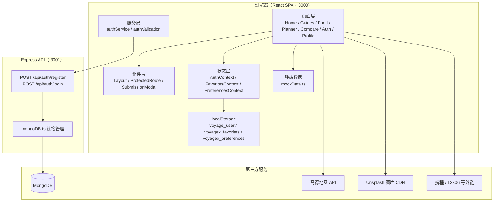
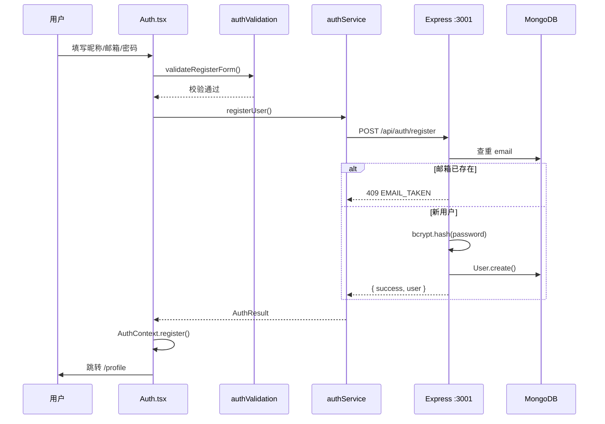
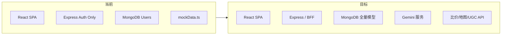

# VoyageX — 全能旅行伴侣

> **您的全能旅行伴侣。** 从灵感发现到路线规划，再到全网比价，我们为您提供一站式旅行服务。

本文档是 VoyageX 项目的**设计说明、架构蓝图与开发指南**，供后续迭代参考。

---

## 目录

1. [设计目的](#1-设计目的)
2. [产品定位与核心价值](#2-产品定位与核心价值)
3. [功能模块与页面布局](#3-功能模块与页面布局)
4. [技术架构](#4-技术架构)
5. [项目目录结构](#5-项目目录结构)
6. [数据流设计](#6-数据流设计)
7. [环境变量与运行方式](#7-环境变量与运行方式)
8. [当前实现状态](#8-当前实现状态)
9. [开发路线图](#9-开发路线图)
10. [开发规范与约定](#10-开发规范与约定)

---

## 1. 设计目的

### 1.1 要解决什么问题

旅行者在规划行程时，信息往往分散在多个平台：攻略在社区、地图在导航 App、比价在 OTA、美食在点评网站。VoyageX 旨在将这些环节**整合到单一 Web 应用中**，降低决策成本，提供连贯的旅行体验。

### 1.2 目标用户

- 计划国内短途/长途旅行的个人用户
- 需要快速获取目的地攻略与美食推荐的用户
- 希望在出发前对比交通、酒店、租车价格的用户
- 希望保存偏好、收藏内容并个性化推荐的注册用户

### 1.3 设计原则

| 原则 | 说明 |
|------|------|
| **一站式** | 探索、攻略、美食、路线、比价在同一产品内完成 |
| **渐进增强** | 未登录可浏览核心内容；登录后解锁个人中心与偏好 |
| **前端优先** | 以 SPA 为核心，后端按需扩展（当前仅用户认证接入数据库） |
| **可扩展** | 预留 AI（Gemini）、UGC 投稿、真实比价 API 的接入点 |

---

## 2. 产品定位与核心价值

```
┌─────────────────────────────────────────────────────────────┐
│                        VoyageX 产品全景                        │
├──────────┬──────────┬──────────┬──────────┬─────────────────┤
│  灵感探索  │  旅行攻略  │  地道美食  │  路线规划  │    全网比价      │
│  (Home)  │ (Guides) │  (Food)  │(Planner) │   (Compare)   │
├──────────┴──────────┴──────────┴──────────┴─────────────────┤
│              用户体系（注册/登录/个人中心/偏好/收藏）              │
├─────────────────────────────────────────────────────────────┤
│         数据层：Mock 内容 + MongoDB 用户 + 第三方地图 API          │
└─────────────────────────────────────────────────────────────┘
```

### 核心价值

1. **发现** — 按半球/目的地浏览，结合用户偏好推荐攻略与美食
2. **规划** — 高德地图驾车路线规划，支持多城市选点与路线对比
3. **决策** — 交通、酒店、租车多平台价格参考与外链预订
4. **沉淀** — 登录用户可管理旅行偏好、收藏列表

---

## 3. 功能模块与页面布局

### 3.1 全局布局（`Layout`）

所有页面共享统一外壳：

```
┌──────────────────────────────────────────────────┐
│  Logo  │ 探索 │ 攻略 │ 美食 │ 规划 │ 比价 │ 登录/头像  │  ← 顶栏导航（sticky）
├──────────────────────────────────────────────────┤
│                                                  │
│                   页面内容区                       │
│                  （<Outlet />）                   │
│                                                  │
├──────────────────────────────────────────────────┤
│  页脚：品牌介绍 · 关于我们 · 隐私政策 · 社交链接      │  ← 部分链接为占位
└──────────────────────────────────────────────────┘
```

- **顶栏**：响应式，移动端汉堡菜单
- **认证态**：未登录显示「登录」；已登录显示头像与退出
- **页脚**：品牌 Slogan + 占位链接（待完善）

### 3.2 路由与页面职责

| 路径 | 页面 | 访问权限 | 主要作用 |
|------|------|----------|----------|
| `/` | Home | 公开 | 首页探索、轮播、半球目的地、个性化推荐 |
| `/guides` | Guides | 公开 | 旅行攻略列表、筛选、投稿入口 |
| `/food` | Food | 公开 | 美食推荐、省份筛选、收藏、详情弹窗 |
| `/planner` | MapPlanner | 公开 | 高德地图路线规划（驾车/预估高铁飞机） |
| `/compare` | Compare | 公开 | 交通/酒店/租车比价，跳转外部预订 |
| `/hotel/:id` | HotelDetail | 公开 | 酒店详情、房型、评价、侧边比价 |
| `/auth` | Auth | 公开 | 登录 / 注册（双栏布局：品牌图 + 表单） |
| `/profile` | Profile | **需登录** | 偏好设置、收藏管理 |

路由定义见 `src/App.tsx`，除 `/profile` 外均为公开路由；`/profile` 由 `ProtectedRoute` 守卫。

### 3.3 各模块详细设计

#### 首页 `/`（Home）

- 自动轮播 Hero 区（Unsplash 图片）
- **个性化推荐**：读取 `PreferencesContext`，对攻略/美食排序后展示 Top 3
- **按半球探索**：东/西/南/北四个 Tab，展示目的地卡片
- 功能入口卡片：跳转攻略、规划、比价

#### 旅行攻略 `/guides`（Guides）

- 数据源：`src/data/mockData.ts` → `travelGuides`（7 条）
- 搜索 + 高级筛选：目的地、天数、预算、标签
- 偏好匹配徽章：与 `travelTypes` 标签命中时显示
- 「发布攻略」→ `SubmissionModal`（**当前为模拟提交**）
- **缺失**：攻略详情页 `/guides/:id`

#### 地道美食 `/food`（Food）

- 数据源：`mockData.ts` → `foodRecommendations`（6 条）
- 省份筛选、评分筛选、关键词搜索
- 心形收藏（写入 `FavoritesContext`）
- 详情弹窗：评价列表、模拟导航按钮
- 「推荐美食」→ `SubmissionModal`（模拟）

#### 路线规划 `/planner`（MapPlanner）

- **真实 API**：高德地图 JS API（驾车路线、逆地理编码）
- 5 个预设城市 + 地图点击添加城市
- 路线卡片：1 条真实驾车路线 + 2 条预估（高铁/飞机，静态数据）
- 地图模式：标准 / 卫星 / 3D
- **注意**：API Key 当前硬编码在组件内，应迁移至环境变量

#### 全网比价 `/compare`（Compare）

- 三个 Tab：交通工具 / 酒店住宿 / 租车服务
- 酒店搜索表单（目的地、日期、人数）→ 模拟 800ms 加载
- 静态比价数据，首项标记「全网最低」
- 酒店 → 跳转 `/hotel/:id`；交通/租车 → 外链（携程、12306 等）

#### 酒店详情 `/hotel/:id`（HotelDetail）

- 内联 Mock 数据（仅 `hotel-1` 有完整数据，其余回退默认）
- 房型、设施、评价、侧边栏多平台价格
- 「立即预订」→ 新窗口打开携程

#### 认证 `/auth`（Auth）

- 左右分栏：左侧品牌视觉（md+ 显示），右侧表单
- 登录 / 注册切换，字段级校验（`authValidation.ts`）
- 注册字段：昵称、邮箱、密码、确认密码
- 成功后跳转来源页或 `/profile`
- 忘记密码：占位提示「即将上线」

#### 个人中心 `/profile`（Profile）

- 展示用户头像、昵称（来自 `AuthContext`）
- 编辑旅行偏好：目的地、旅行类型、辣度、口味
- 收藏列表：筛选、排序、删除
- 偏好影响首页/攻略/美食的推荐排序（纯客户端）

---

## 4. 技术架构

### 4.1 技术栈

| 层级 | 技术 | 版本/说明 |
|------|------|-----------|
| 前端框架 | React | 19 |
| 路由 | React Router DOM | 7 |
| 语言 | TypeScript | 5.8 |
| 构建 | Vite | 6 |
| 样式 | Tailwind CSS | 4（`@tailwindcss/vite`） |
| 动画 | Framer Motion | 12 |
| 图标 | Lucide React | — |
| 后端 | Express | 4 |
| 数据库 | MongoDB + Mongoose | 9 |
| 密码加密 | bcryptjs | — |
| 地图 | 高德 AMap JS API | 路线规划页使用 |
| AI（预留） | @google/genai | 已安装，**未接入业务** |
| 地图（未用） | Leaflet / react-leaflet | 已安装，CSS 已引入，无页面使用 |

### 4.2 系统架构图



### 4.3 前端架构分层

```
main.tsx
  └── App.tsx
        ├── AuthProvider          ← 用户会话（localStorage: voyage_user）
        ├── FavoritesProvider     ← 收藏（localStorage: voyagex_favorites）
        ├── PreferencesProvider   ← 偏好（localStorage: voyagex_preferences）
        └── BrowserRouter
              └── Layout（顶栏 + Outlet + 页脚）
                    └── 各页面（React.lazy 懒加载）
```

**状态管理策略**：不使用 Redux/Zustand，采用 React Context + localStorage 持久化。适合当前规模；用户量增长后建议将收藏/偏好同步至服务端。

### 4.4 后端架构

当前后端**仅负责用户认证**，与前端同仓维护：

```
src/server/index.ts
  ├── dotenv 加载 .env.local / .env
  ├── connectToDB() → mongoose
  ├── POST /api/auth/register  → User.create（bcrypt 哈希密码）
  └── POST /api/auth/login     → User.findOne + bcrypt.compare
```

数据模型（`src/lib/database/models/User.ts`）：

| 字段 | 类型 | 说明 |
|------|------|------|
| `name` | String | 昵称，最长 20 字符 |
| `email` | String | 邮箱，唯一、小写 |
| `password` | String | bcrypt 加密后的密码 |
| `createdAt` / `updatedAt` | Date | 自动时间戳 |

### 4.5 认证模型（当前）

```
注册/登录成功
  → 服务端返回 { id, email, name, avatar }
  → AuthContext 写入 localStorage（voyage_user）
  → 后续请求不携带 Token（无 JWT / Session）
```

- **演示账号**（无需数据库）：`demo@voyagex.com` / `123456`，逻辑在 `authService.ts` 硬编码
- **真实账号**：经 Express API 读写 MongoDB
- **安全局限**：刷新页面后仅依赖 localStorage，服务端不校验会话；生产环境需引入 JWT 或 Session

### 4.6 开发代理

Vite 将 `/api` 代理至 `http://localhost:3001`，前端统一使用 `fetch('/api/...')`，无需处理 CORS。

---

## 5. 项目目录结构

```
voyagex/
├── index.html                 # SPA 入口 HTML
├── package.json
├── tsconfig.json
├── vite.config.ts             # Vite 配置 + /api 代理
├── .env.example               # 环境变量模板
├── .env.local                 # 本地密钥（勿提交版本库）
│
└── src/
    ├── main.tsx               # React 挂载入口
    ├── App.tsx                # 路由 + Context 提供者
    ├── index.css              # 全局样式 + Tailwind + Leaflet CSS
    │
    ├── pages/                 # 页面（按路由划分）
    │   ├── Home.tsx
    │   ├── Guides.tsx
    │   ├── Food.tsx
    │   ├── MapPlanner.tsx
    │   ├── Compare.tsx
    │   ├── HotelDetail.tsx
    │   ├── Auth.tsx
    │   └── Profile.tsx
    │
    ├── components/            # 可复用 UI
    │   ├── Layout.tsx         # 全局布局壳
    │   ├── ProtectedRoute.tsx # 登录路由守卫
    │   └── SubmissionModal.tsx# UGC 投稿弹窗（模拟）
    │
    ├── context/               # 全局状态
    │   ├── AuthContext.tsx
    │   ├── FavoritesContext.tsx
    │   └── PreferencesContext.tsx
    │
    ├── lib/                   # 工具与服务
    │   ├── authService.ts     # 登录/注册 API 客户端
    │   ├── authValidation.ts  # 表单校验规则
    │   ├── utils.ts           # cn() 等工具函数
    │   └── database/
    │       ├── mongoDB.ts     # Mongoose 连接
    │       └── models/
    │           └── User.ts    # 用户模型
    │
    ├── data/
    │   └── mockData.ts        # 攻略 + 美食静态数据
    │
    └── server/
        └── index.ts           # Express API 服务入口
```

### 命名与品牌约定（待统一）

| 场景 | 当前名称 | 建议 |
|------|----------|------|
| UI 品牌 | VoyageX | 保持不变 |
| npm 包名 | `react-example` | 改为 `voyagex` |
| 数据库名 | `voyagex` | 保持不变 |
| 用户存储 key | `voyage_user` | 统一为 `voyagex_user` |
| 收藏/偏好 key | `voyagex_*` | 保持不变 |

---

## 6. 数据流设计

### 6.1 用户注册流程



### 6.2 内容推荐流程（客户端）

```
PreferencesContext（目的地、旅行类型、口味）
        ↓
Home / Guides / Food 读取 preferences
        ↓
对 mockData 打分排序（标签匹配、目的地匹配）
        ↓
展示「匹配偏好」徽章 + 优先排序
```

### 6.3 收藏流程

```
Food 页点击心形
  → FavoritesContext.toggleFavorite()
  → localStorage: voyagex_favorites
  → Profile 页读取、筛选、排序、删除
```

> 收藏类型已定义 `guide | food | hotel | route`，目前仅美食页实现了收藏按钮。

### 6.4 数据来源总览

| 功能 | 数据来源 | 是否真实 API |
|------|----------|--------------|
| 旅行攻略 | `mockData.ts` | 否 |
| 美食推荐 | `mockData.ts` | 否 |
| 比价数据 | `Compare.tsx` 内联 | 否 |
| 酒店详情 | `HotelDetail.tsx` 内联 | 否 |
| 驾车路线 | 高德 Driving API | **是** |
| 地图逆地理编码 | 高德 Geocoder | **是** |
| 用户注册/登录 | MongoDB + Express | **是** |
| 用户会话/收藏/偏好 | localStorage | 客户端本地 |
| UGC 投稿 | 模拟延时 | 否 |
| Gemini AI | 未使用 | — |

---

## 7. 环境变量与运行方式

### 7.1 环境变量

复制 `.env.example` 为 `.env.local` 并填写：

| 变量 | 必填 | 说明 |
|------|------|------|
| `MONGO_URI` | 注册/登录时必填 | MongoDB 连接串，如 `mongodb://localhost:27017/voyagex` 或 Atlas URI |
| `SERVER_PORT` | 否 | API 端口，默认 `3001` |
| `GEMINI_API_KEY` | 否 | Gemini AI（预留，当前未使用） |
| `APP_URL` | 否 | 部署 URL（预留，AI Studio / Cloud Run） |
| `DISABLE_HMR` | 否 | 设为 `true` 时禁用 Vite 热更新 |

### 7.2 安装与启动

**前置条件**：Node.js 18+、MongoDB（本地或 Atlas）

```bash
# 1. 安装依赖
npm install

# 2. 配置环境变量
cp .env.example .env.local
# 编辑 .env.local，填入 MONGO_URI

# 3. 启动 API 服务（终端 1）
npm run server

# 4. 启动前端（终端 2）
npm run dev
```

访问：**http://localhost:3000**

> Windows 用户请勿依赖 `npm run dev:all`（使用 Unix 的 `&` 语法）。请分两个终端分别运行 `server` 与 `dev`。

### 7.3 可用脚本

| 命令 | 作用 |
|------|------|
| `npm run dev` | 启动 Vite 前端（端口 3000） |
| `npm run server` | 启动 Express API（端口 3001） |
| `npm run build` | 构建生产包至 `dist/` |
| `npm run preview` | 预览生产构建 |
| `npm run lint` | TypeScript 类型检查 |
| `npm run clean` | 删除 `dist/`（Unix 命令，Windows 可手动删除） |

### 7.4 快速体验（无需数据库）

使用演示账号登录：

- 邮箱：`demo@voyagex.com`
- 密码：`123456`

---

## 8. 当前实现状态

### 8.1 已完成

- [x] 全站页面框架与导航布局
- [x] 首页探索、个性化推荐、半球目的地
- [x] 攻略列表与筛选（Mock 数据）
- [x] 美食列表、收藏、详情弹窗（Mock 数据）
- [x] 高德地图驾车路线规划
- [x] 交通/酒店/租车比价 UI（Mock 数据）
- [x] 酒店详情页（部分 Mock）
- [x] 用户注册/登录（MongoDB 持久化）
- [x] 个人中心：偏好编辑、收藏管理
- [x] 路由懒加载、表单校验、响应式布局

### 8.2 未完成 / 已知局限

| 领域 | 状态 | 说明 |
|------|------|------|
| Gemini AI | 未接入 | 依赖已安装，无业务调用 |
| Leaflet 地图 | 未使用 | 已引入 CSS，MapPlanner 使用高德 |
| 攻略详情页 | 缺失 | 卡片不可跳转 `/guides/:id` |
| UGC 投稿 | 仅 UI | 无后端存储与审核流程 |
| 比价搜索 | 模拟 | 表单参数不影响结果 |
| 忘记密码 | 占位 | 仅提示文案 |
| 会话安全 | 基础 | 无 JWT/Session，仅靠 localStorage |
| 收藏同步 | 本地 | 未登录也可用；无服务端同步 |
| 攻略/酒店收藏 | 未实现 UI | 类型已定义，仅美食有心形按钮 |
| 页脚链接 | 占位 | About/Privacy 等为 `#` |
| AMap Key | 硬编码 | 应迁移至环境变量并配置域名白名单 |
| 偏好标签对齐 | 部分 | Profile 旅行类型与攻略 tags 重叠有限 |
| 测试 / CI | 无 | 无单元测试与流水线 |
| 项目文档 | 本文档 | 首次编写 |

---

## 9. 开发路线图

以下按优先级排列，作为后续迭代的**推荐顺序**。

### Phase 1 — 基础完善（短期）

1. **统一品牌命名**：`package.json`、localStorage key、HTML title
2. **认证增强**：JWT 或 Session Cookie；`ProtectedRoute` 校验 Token
3. **环境变量治理**：高德 Key、`MONGO_URI` 全部走 `.env.local`
4. **攻略详情页**：`/guides/:id`，复用 mockData 或扩展字段
5. **修复已知 TS 问题**：`Compare.tsx`、`SubmissionModal.tsx` 的 React 命名空间

### Phase 2 — 数据服务化（中期）

1. **内容 API**：Guide、Food、Hotel 的 Mongoose 模型 + CRUD
2. **收藏/偏好同步**：登录用户数据写入 MongoDB，与 localStorage 双向同步
3. **UGC 投稿后端**：`SubmissionModal` 对接 `POST /api/submissions` + 审核状态
4. **比价服务**：对接 OTA 聚合 API 或自建爬虫层（注意合规）
5. **忘记密码**：邮件验证码 + 重置流程

### Phase 3 — 智能与增长（长期）

1. **Gemini 集成**：智能行程生成、攻略摘要、美食推荐对话
2. **个性化推荐引擎**：服务端根据行为与偏好计算，替代纯客户端排序
3. **多语言**：i18n（当前 UI 为中文，`index.html` lang 为 en）
4. **PWA / 移动端优化**
5. **测试体系**：Vitest 组件测试 + API 集成测试 + CI

### 架构演进目标



---

## 10. 开发规范与约定

### 10.1 新增页面

1. 在 `src/pages/` 创建组件
2. 在 `App.tsx` 添加 `lazy` 导入与 `<Route>`
3. 如需登录保护，用 `<ProtectedRoute>` 包裹
4. 如需导航入口，更新 `Layout.tsx` 导航项

### 10.2 新增 API

1. 在 `src/lib/database/models/` 定义 Mongoose 模型
2. 在 `src/server/index.ts`（或拆分为 `routes/`）添加路由
3. 在 `src/lib/` 添加对应 `fetch` 客户端函数
4. 前端通过 `/api/...` 调用（走 Vite 代理）

### 10.3 样式约定

- 使用 Tailwind CSS 工具类
- 复杂类名合并使用 `cn()`（`src/lib/utils.ts`）
- 品牌主色：橙色系（`orange-*`）+ 深色按钮（`#1a1918`）
- 圆角风格：`rounded-2xl` / `rounded-3xl`
- 字体：标题使用 `font-serif`

### 10.4 提交前检查

```bash
npm run lint    # 类型检查
npm run build   # 确保可构建
```

### 10.5 安全提醒

- **切勿**将 `.env.local` 提交至 Git
- 生产环境密码必须 bcrypt 哈希（已实现）
- 生产环境需 HTTPS + 安全 Cookie / JWT
- 第三方 API Key 不得硬编码在源码中

---

## 附录

### A. 演示账号

| 邮箱 | 密码 | 说明 |
|------|------|------|
| `demo@voyagex.com` | `123456` | 本地硬编码，无需 MongoDB |

### B. 外部依赖服务

- [高德开放平台](https://lbs.amap.com/) — 地图与路线
- [Unsplash](https://unsplash.com/) — 展示图片
- [ui-avatars.com](https://ui-avatars.com/) — 注册用户默认头像
- 携程、12306 等 — 比价外链跳转

### C. 许可证

前端源码头部标注：`SPDX-License-Identifier: Apache-2.0`

---

*本文档随项目演进更新。每次重大架构或功能变更后，请同步修订对应章节。*
